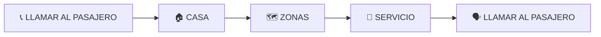
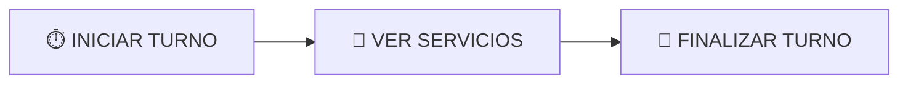

# 🚕 C_Gacela 🚕

<a href="https://github.com/dwn10/C_Gacela/blob/main/img/g1.jpg"></a>

<a href="https://github.com/dwn10/C_Gacela/blob/main/img/g2.jpg"></a>
 
## MEDIR UNA CARRERA

**1ra DIRECCIÓN:** (ESCRIBIR LA DIRECCIÓN DE ORIGEN)

**INDICACIONES:**

* PRESIONAR FLECHAS
  
**2da DIRECCIÓN:** (ESCRIBIR DIRECCIÓN DE DESTINO)
* BUSCAR RUTA MÁS CORTA
* COBRAR RUTA MÁS CORTA

**INFORMACIÓN DE CARRERA:**

* DIRECCIÓN DE DESTINO
* NOMBRE DEL PASAJERO
* NÚMERO DEL PASAJERO

**ACCIONES:**

* 📞 LLAMAR AL PASAJERO
* 🏠 CASA
* 🗺️ ZONAS
* 🚕 SERVICIO
* 🗣️ LLAMAR AL PASAJERO



**TAXI CALLER:**

* ⏱️ INICIAR TURNO
* 📄 VER SERVICIOS
* 🏁 FINALIZAR TURNO



**COMUNICACIÓN:**

* VIA TELEGRAM

**EJEMPLO:**

* 🌞 `84 INICIA TURNO`
* 🌑 `84 FINALIZA TURNO`

### 🚕 COBRO CARRERA

* 📱 CARRERA POR APLICACIÓN
* 📞 CARRERA POR LA BASE

* 💰 **VALOR COBRO POR MILLA - SOLICITADO POR APLICACIÓN** $1.80
* 💰 **VALOR COBRO POR MILLA - SOLICITADO POR LA BASE** $2.00

* RECORDAR A LOS CLIENTES UTILIZAR LA APLICACIÓN PARA LOS BENEFICIOS DE LA CARRERA 

### NÚMEROS DE LA BASE:
```bash
📞 631-415-0800
```
```bash 
📞 610-422-8117
```

### CÓMO PEDIR UNA TARIFA

* RECOGÍ EN LA 155 NORTH BABYLON, HICIMOS UNA PARADA EN 165 MAIDA AVENUE. (PARADA DURO 5 min)
* Y TERMINAMOS EN LA 148 ALLEN BOULEVARD
* EL RECORRIDO COMPLETO FUE DE 4.7 MILLAS

### LIMPIAR CARRERAS

- ESPERAR EL CONTEO
- PRESIONAR (DESCARTAR)

### TIEMPO DE ESPERA

* 10 MINUTOS DESPUÉS DE LA HORA PROGRAMADA
* 10 MINUTOS DESDE TU LLEGADA SI NO ESTÁ PROGRAMADA
* `(OJO)` JAMÁS PONER (NO SE PRESENTÓ)
* PEDIR AUTORIZACIÓN A LA BASE Y LUEGO DE COMENTARLE TU SITUACIÓN CON EL SERVICIO.


### NO SE PRESENTÓ

* ▶️ TRIÁNGULO
* ⏳ ESPERAR

* ▶️ TRIÁNGULO
* ⏳ ESPERAR UNOS SEGUNDOS Y APARECE LA OPCIÓN ❌ CANCELAR
* 🚫 NO SE PRESENTÓ

### 💳 FORMAS DE PAGO
* 💵 EFECTIVO
* 📱 ZELLE

### DESCUENTO = $ 1

* PARA ESTUDIANTES
* PARA TRABAJADORES
* DOS O TRES PERSONAS NO TIENEN DESCUENTO
* PARA CUATRO PERSONAS, SE COBRARÁ UN ADICIONAL PREGUNTAR A LOS DISPATCHERS

### COBROS DIFERENTES POR PARADAS

**EJEMPLO:**

* RECOGEN A DOS PERSONAS EN UN SITIO Y VAN A DIFERENTES DIRECCIONES SE COBRARÁ INDIVIDUALMENTE
* SOLICITAR RESPALDO DEL DISPATCHER PARA HACER UN REAJUSTE

### COBRO PARA 2 PERSONAS O MÁS CON DISTINTOS DESTINOS:

* COBRAMOS EL 70% DEL VALOR EN DINERO, NO DE LAS MILLAS

**EJEMPLO:**

* RECOGEMOS A 2 PERSONAS. PUNTO (A)
* DEJAMOS A UNA PERSONA EN EL PRIMER DESTINO (B)
    * A 1.8 MILLAS, EL VALOR EN DINERO ES $5 DÓLARES
    * SACAREMOS EL 70% DE $5 DÓLARES EL CUAL ES $3.50
* DEJAMOS A LA SEGUNDA PERSONA EN EL PUNTO (C)
    * A 3.7 MILLAS, EL VALOR ES $7 DÓLARES
    * SACAREMOS EL 70% DE $7 DÓLARES, EL CUAL ES $4.90

* PRIMERA PARADA: $3.50
* SEGUNDA PARADA: $4.90
* VALOR TOTAL DE LA CARRERA DE 3.7 MILLAS = $8.40 (APROXIMADAMENTE, LA SUMA DE LOS DOS MONTOS)

**CONSIDERACIONES PARA EL COBRO:**

* AL MULTIPLICAR, A VECES EL VALOR PUEDE SER $4.51. EN ESE CASO, REDONDEAMOS HACIA ARRIBA A $5.
* CUANDO ES $4.50, REDONDEAMOS HACIA ABAJO A $4.

### COBRO APLICACIÓN: MÚLTIPLES DESTINOS (2+ PERSONAS)

* **TARIFA POR MILLA:** $1.80
* **COMISIÓN:** 70% DEL VALOR DE CADA CARRERA

**EJEMPLO:**

RECOGIDA DE 2 PERSONAS EN EL PUNTO (A):

* **PRIMERA PARADA (B):**
    * DISTANCIA: 2.2 MILLAS
    * CÁLCULO: 2.2 X $1.80 = $3.96
    * COMISIÓN (70%): $3.96 X 0.70 = $2.77
* **SEGUNDA PARADA:**
    * DISTANCIA: 2.5 MILLAS
    * CÁLCULO: 2.5 X $1.80 = $4.50
    * COMISIÓN (70%): $4.50 X 0.70 = $3.15

**RESUMEN:**

* PRIMERA PARADA: $2.77
* SEGUNDA PARADA: $3.15
* **TOTAL DE LA CARRERA:** $5.92

**FORMAS DE PAGO:**

* EFECTIVO: $6.00
* ZELLE: $5.92

### 🚕🔄 CÓMO HACER UN IDA Y VUELTA DE UNA CARRERA 🚕🔄

1.  🏁 CUANDO LLEGAMOS AL DESTINO
2.  ▶️ PRESIONAMOS TRIÁNGULO (⏳ ESPERANDO ⏳)
3.  ↩️ AUTOMÁTICAMENTE APARECE LA FLECHA EN EL ORIGEN
4.  🗣️ AVISAR A LA BASE QUE TIENE UN IDA Y VUELTA...
    * ASÍ ELLOS ESTÁN ENTERADOS ✅
5.  💰 COBRAR EL 60% DE LA CARRERA DE IDA, ESE ES EL VALOR  +  EL 60% DE REGRESO
   
### 🚕 ¡DELIVERY DE CERVEZA! 🍻

* PREGUNTAR AL CLIENTE **QUÉ** QUIERE HACER... LA FORMA **SON**...
* NOS HACE UNA TRANSFERENCIA POR ZELLE 💸.
* COMPRAMOS Y LLEVAMOS LA CERVEZA 🚚.

### 2DA OPCIÓN 🚗

* VAMOS POR EL CLIENTE, LO RECOGEMOS, COMPRAMOS LA CERVEZA Y LO REGRESAMOS A SU DOMICILIO 🏠.

### JAMÁS PRESIONAR LA ALARMA (SYNC) 🚨.

### CERRAR UNA CARRERA

* COMPENSA 👍
* TERMINADO 🏁
* CONFIRMAR TARIFA 🧾
* INGRESAR TARIFA ⌨️
* GUARDAR 💾
* CONFIRMAR ✅
* EFECTIVO 💵
* INGRESAR ⌨️
* FIN...
